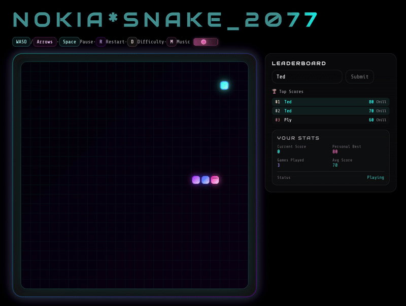
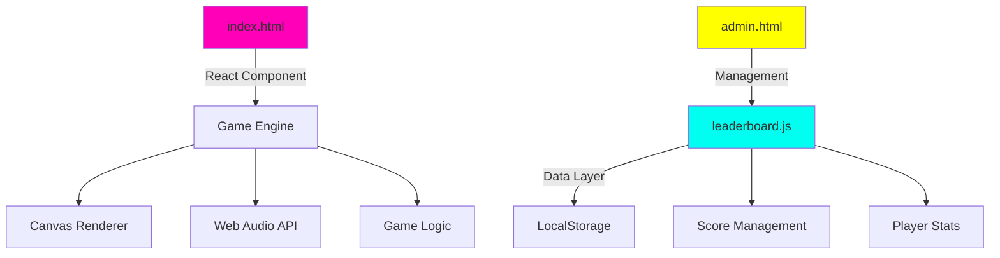

<div align="center">

# 🐍 NOKIA*SNAKE_2077 - Classic Nokia Snake Game Reimagined


### 🎮 The Ultimate Nostalgic Nokia Snake Game with Cyberpunk 2077 Aesthetics
#### Experience Classic Mobile Gaming with Modern Browser Technology - Play Free Online Now!

[Play Now](https://nokia-snake2077.replit.app) | [中文文档](README_CN.md) | [Report Bug](https://github.com/todd1143/NOKIA-SNAKE_2077/issues) | [Request Feature](https://github.com/todd1143/NOKIA-SNAKE_2077/issues)



</div>

---

## 🔍 What Makes This Special?

**NOKIA*SNAKE_2077** perfectly captures the **nostalgic Nokia phone gaming experience** that defined a generation while bringing it into the modern era with stunning **cyberpunk 2077 aesthetics**. Whether you remember playing Snake on your classic Nokia 3310, Nokia 6600, or any other iconic Nokia mobile phone, this **retro browser game** will transport you back to those simpler times.

**Keywords:** Nokia Snake game, retro snake game, nostalgic mobile games, Nokia phone games, classic arcade games, browser games 2077, HTML5 snake game, cyberpunk games, neon snake game, vintage gaming

---

## ✨ Features

### 🎨 **Cyberpunk Visuals**
- **Flowing Neon Title** - Dynamic light strip effect mimicking snake movement
- **Gradient Neon Effects** - Multi-layered glow with animated color transitions
- **Retro-Future UI** - Inspired by 80s cyberpunk aesthetics
- **Responsive Canvas** - Adapts perfectly to any screen size

### 🎵 **Procedural Audio System**
- **Dynamic Music Generation** - Real-time synthesized cyberpunk soundtrack
- **Adaptive BPM** - Music tempo changes with game difficulty
- **8-bit Sound Effects** - Nostalgic arcade-style audio feedback
- **Volume Control** - Adjustable music levels or complete mute

### 🏆 **Advanced Leaderboard**
- **Persistent Storage** - LocalStorage-based score tracking
- **Player Statistics** - Track games played, total score, average performance
- **Top 50 Rankings** - Competitive local leaderboard system
- **Data Management** - Export/import functionality for backup

### 🎮 **Gameplay Features**
- **Three Difficulty Modes**
  - 🌊 **Chill** - Relaxed pace for casual players
  - ⚡ **Swift** - Balanced challenge for regular players
  - 🔥 **Hyper** - Extreme speed for hardcore gamers
- **Mobile Support** - Touch-optimized D-pad controls
- **Classic & Modern** - Traditional snake mechanics with cyberpunk twist

---

## 🚀 Quick Start

### **Option 1: GitHub Pages** (Recommended)
```bash
# Fork this repository
# Go to Settings > Pages
# Select "Deploy from branch" > main > / (root)
# Your game will be live at https://nokia-snake2077.replit.app
```

### **Option 2: Local Development**
```bash
# Clone the repository
git clone https://github.com/todd1143/NOKIA-SNAKE_2077.git
cd NOKIA-SNAKE_2077

# Start with Python (no dependencies needed!)
python3 -m http.server 8000

# Or use npm scripts
npm start     # Starts on port 3000
npm run dev   # Starts on port 8000

# Open in browser
open http://localhost:8000
```

### **Option 3: Deploy to Replit**
[](https://replit.com/github/todd1143/NOKIA-SNAKE_2077)

---

## 🎯 How to Play

### **Keyboard Controls**
| Key | Action |
|-----|--------|
| `W` `↑` | Move Up |
| `A` `←` | Move Left |
| `S` `↓` | Move Down |
| `D` `→` | Move Right |
| `Space` | Pause/Resume |
| `R` | Restart Game |
| `M` | Toggle Music |

### **Mobile Controls**
- Use the on-screen D-pad for movement
- Tap pause button to pause/resume
- Swipe gestures supported

---

## 🏗️ Architecture



### **Tech Stack**
- **Frontend**: React 18 (CDN), Vanilla JavaScript ES6+
- **Graphics**: HTML5 Canvas API
- **Audio**: Web Audio API with Oscillators
- **Storage**: LocalStorage API
- **Styling**: Inline CSS with Keyframe Animations
- **Server**: Python HTTP Server (zero dependencies)

---

## 📁 Project Structure

```
nokia-snake-2077/
├── 🎮 index.html          # Main game (React component + game logic)
├── 💾 leaderboard.js      # Data management module
├── 🔧 admin.html          # Admin panel for data management
├── 📝 README.md           # This file
├── 📝 README_CN.md        # Chinese documentation
├── 📦 package.json        # Project metadata
├── 🔄 replit.nix         # Replit configuration
├── 📂 assets/            # Game assets
│   └── images/
│       ├── icons/        # Game icons
│       └── screenshots/  # Game screenshots
└── 🛠️ Tools/
    ├── clear_data.html   # Data clearing utility
    └── create_icons.html # Icon generation tool
```

---

## 🎨 Customization

### **Game Configuration**
Edit these values in `index.html`:

```javascript
const GAME_TITLE = "NOKIA*SNAKE_2077";  // Game title
const GRID = 24;                        // Grid size (24x24)
const DEFAULT_TPS = 8;                  // Default speed
const MAX_TPS = 16;                     // Maximum speed
const WALLS = true;                     // Enable wall collision
```

### **Color Theme**
Modify the neon color scheme:

```javascript
// In index.html - search for color definitions
const COLORS = {
  neon_cyan: '#00fff0',
  neon_magenta: '#ff00b8',
  neon_purple: '#aa00ff',
  grid: 'rgba(0, 255, 240, 0.03)'
};
```

### **Music Parameters**
Adjust the procedural music generator:

```javascript
const BPM = 140;                   // Base tempo
const BASS_PATTERN = [36, 48];    // Bass note sequence
const LEAD_SCALE = [0,3,5,7,10];  // Pentatonic scale
```

---

## 🔧 Development

### **Prerequisites**
- Modern web browser (Chrome/Firefox/Safari/Edge)
- Python 3.x (for local server) OR any HTTP server
- No build tools or npm install required!

### **Testing Checklist**
- [ ] Game controls (keyboard & mobile)
- [ ] Score submission and leaderboard
- [ ] Music generation and sound effects
- [ ] Difficulty progression
- [ ] Data persistence
- [ ] Cross-browser compatibility
- [ ] Mobile responsiveness

### **Browser Support**
| Browser | Version | Status |
|---------|---------|--------|
| Chrome | 90+ | ✅ Full Support |
| Firefox | 88+ | ✅ Full Support |
| Safari | 14+ | ✅ Full Support |
| Edge | 90+ | ✅ Full Support |
| Mobile Chrome | Latest | ✅ Full Support |
| Mobile Safari | Latest | ✅ Full Support |

---

## 📊 Admin Panel

Access the admin panel at `/admin.html` to:

- 📈 View detailed game statistics
- 💾 Export leaderboard data as JSON
- 🗑️ Clear all stored data
- 📊 Analyze player performance metrics
- 🔍 Debug data issues

**Admin Features:**
```javascript
// Example: Export data programmatically
const data = LeaderboardManager.exportData();
console.log(data);

// Example: Clear specific data
LeaderboardManager.clearLeaderboard();
```

---

## 🤝 Contributing

Contributions are what make the open source community amazing! Any contributions you make are **greatly appreciated**.

1. Fork the Project
2. Create your Feature Branch (`git checkout -b feature/AmazingFeature`)
3. Commit your Changes (`git commit -m 'Add some AmazingFeature'`)
4. Push to the Branch (`git push origin feature/AmazingFeature`)
5. Open a Pull Request

### **Development Guidelines**
- Keep the single-file architecture (no build tools)
- Maintain browser compatibility
- Test on mobile devices
- Follow existing code style
- Add comments for complex logic

---

## 📈 Performance

- **60 FPS** gameplay on modern devices
- **< 1ms** input latency
- **< 100KB** total size (excluding fonts)
- **Instant** load time (no build step)
- **Zero** npm dependencies

---

## 🛡️ Security

- No external API calls
- All data stored locally
- No tracking or analytics
- No cookies used
- Open source and auditable

---

## 📄 License

Distributed under the MIT License. See `LICENSE` for more information.

---

## 🙏 Acknowledgments

- [React Team](https://react.dev) - For the amazing framework
- [Web Audio API](https://developer.mozilla.org/en-US/docs/Web/API/Web_Audio_API) - For procedural music
- [Cyberpunk Aesthetics](https://www.reddit.com/r/Cyberpunk/) - For visual inspiration
- [Classic Snake Game]() - For the timeless gameplay

---

## 📬 Contact

**Todd** - [GitHub Profile](https://github.com/todd1143)

Project Link: [https://github.com/todd1143/NOKIA-SNAKE_2077](https://github.com/todd1143/NOKIA-SNAKE_2077)

---

<div align="center">

### 🌟 Star this repo if you enjoyed the game!


**Made with 💜 and ⚡ by Todd**

[⬆ Back to Top](#-nokiasnakc_2077)

</div>