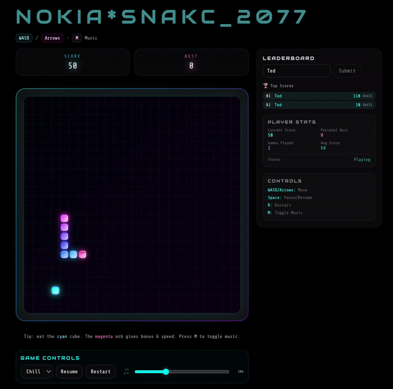
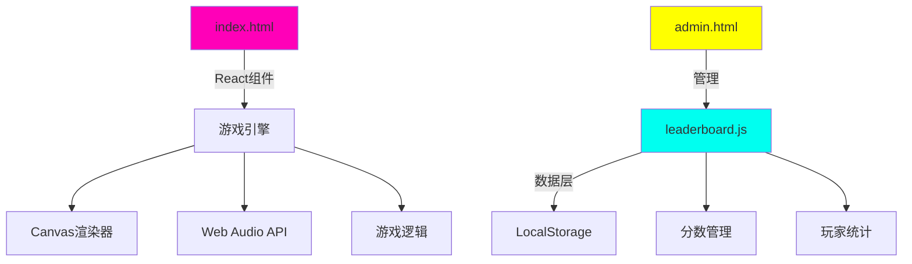

<div align="center">

# 🐍 NOKIA*SNACK_2077


### 🎮 赛博朋克贪吃蛇游戏 - 程序化音乐与霓虹美学

[立即游玩](https://nokia-snack2077.replit.app) | [English](README.md) | [报告问题](https://github.com/todd1143/NOKIA-SNACK_2077/issues) | [功能请求](https://github.com/todd1143/NOKIA-SNACK_2077/issues)



</div>

---

## ✨ 特色功能

### 🎨 **赛博朋克视觉效果**
- **流动霓虹标题** - 模拟蛇形运动的动态光带效果
- **渐变霓虹特效** - 多层发光效果配合动态颜色过渡
- **复古未来界面** - 灵感来自80年代赛博朋克美学
- **响应式画布** - 完美适配任何屏幕尺寸

### 🎵 **程序化音频系统**
- **动态音乐生成** - 实时合成赛博朋克风格配乐
- **自适应BPM** - 音乐节奏随游戏难度变化
- **8位音效** - 怀旧街机风格音频反馈
- **音量控制** - 可调节音乐音量或完全静音

### 🏆 **高级排行榜系统**
- **持久化存储** - 基于LocalStorage的分数追踪
- **玩家统计** - 追踪游戏次数、总分、平均表现
- **前50名排名** - 竞争性本地排行榜系统
- **数据管理** - 导出/导入功能用于备份

### 🎮 **游戏玩法特色**
- **三种难度模式**
  - 🌊 **悠闲** - 休闲玩家的轻松节奏
  - ⚡ **迅捷** - 常规玩家的平衡挑战
  - 🔥 **极速** - 硬核玩家的极限速度
- **移动端支持** - 触控优化的方向键控制
- **经典与现代** - 传统贪吃蛇机制配合赛博朋克风格

---

## 🚀 快速开始

### **方式1：GitHub Pages**（推荐）
```bash
# Fork这个仓库
# 进入Settings > Pages
# 选择"Deploy from branch" > main > / (root)
# 你的游戏将在 https://[用户名].github.io/NOKIA-SNACK_2077 上线
```

### **方式2：本地开发**
```bash
# 克隆仓库
git clone https://github.com/todd1143/NOKIA-SNACK_2077.git
cd NOKIA-SNACK_2077

# 使用Python启动（无需安装依赖！）
python3 -m http.server 8000

# 或使用npm脚本
npm start     # 在端口3000启动
npm run dev   # 在端口8000启动

# 在浏览器中打开
open http://localhost:8000
```

### **方式3：部署到Replit**
[](https://replit.com/github/todd1143/NOKIA-SNACK_2077)

---

## 🎯 游戏操作

### **键盘控制**
| 按键 | 操作 |
|-----|--------|
| `W` `↑` | 向上移动 |
| `A` `←` | 向左移动 |
| `S` `↓` | 向下移动 |
| `D` `→` | 向右移动 |
| `空格` | 暂停/继续 |
| `R` | 重新开始 |
| `M` | 切换音乐 |

### **移动端控制**
- 使用屏幕上的方向键进行移动
- 点击暂停按钮来暂停/继续
- 支持滑动手势

---

## 🏗️ 架构设计



### **技术栈**
- **前端**: React 18 (CDN)、原生JavaScript ES6+
- **图形**: HTML5 Canvas API
- **音频**: Web Audio API振荡器
- **存储**: LocalStorage API
- **样式**: 内联CSS配合关键帧动画
- **服务器**: Python HTTP服务器（零依赖）

---

## 📁 项目结构

```
nokia-snakc-2077/
├── 🎮 index.html          # 主游戏（React组件+游戏逻辑）
├── 💾 leaderboard.js      # 数据管理模块
├── 🔧 admin.html          # 数据管理的管理面板
├── 📝 README.md           # 英文文档
├── 📝 README_CN.md        # 本文档
├── 📦 package.json        # 项目元数据
├── 🔄 replit.nix         # Replit配置
├── 📂 assets/            # 游戏资源
│   └── images/
│       ├── icons/        # 游戏图标
│       └── screenshots/  # 游戏截图
└── 🛠️ Tools/
    ├── clear_data.html   # 数据清理工具
    └── create_icons.html # 图标生成工具
```

---

## 🎨 自定义配置

### **游戏配置**
在`index.html`中编辑这些值：

```javascript
const GAME_TITLE = "NOKIA*SNAKC_2077";  // 游戏标题
const GRID = 24;                        // 网格大小（24x24）
const DEFAULT_TPS = 8;                  // 默认速度
const MAX_TPS = 16;                     // 最大速度
const WALLS = true;                     // 启用墙壁碰撞
```

### **颜色主题**
修改霓虹配色方案：

```javascript
// 在index.html中 - 搜索颜色定义
const COLORS = {
  neon_cyan: '#00fff0',
  neon_magenta: '#ff00b8',
  neon_purple: '#aa00ff',
  grid: 'rgba(0, 255, 240, 0.03)'
};
```

### **音乐参数**
调整程序化音乐生成器：

```javascript
const BPM = 140;                   // 基础节奏
const BASS_PATTERN = [36, 48];    // 低音音符序列
const LEAD_SCALE = [0,3,5,7,10];  // 五声音阶
```

---

## 🔧 开发指南

### **前置要求**
- 现代网页浏览器（Chrome/Firefox/Safari/Edge）
- Python 3.x（用于本地服务器）或任何HTTP服务器
- 无需构建工具或npm install！

### **测试清单**
- [ ] 游戏控制（键盘和移动端）
- [ ] 分数提交和排行榜
- [ ] 音乐生成和音效
- [ ] 难度递进
- [ ] 数据持久化
- [ ] 跨浏览器兼容性
- [ ] 移动端响应式

### **浏览器支持**
| 浏览器 | 版本 | 状态 |
|---------|---------|--------|
| Chrome | 90+ | ✅ 完全支持 |
| Firefox | 88+ | ✅ 完全支持 |
| Safari | 14+ | ✅ 完全支持 |
| Edge | 90+ | ✅ 完全支持 |
| 移动端Chrome | 最新版 | ✅ 完全支持 |
| 移动端Safari | 最新版 | ✅ 完全支持 |

---

## 📊 管理面板

访问`/admin.html`管理面板可以：

- 📈 查看详细游戏统计
- 💾 导出排行榜数据为JSON
- 🗑️ 清除所有存储数据
- 📊 分析玩家表现指标
- 🔍 调试数据问题

**管理功能：**
```javascript
// 示例：程序化导出数据
const data = LeaderboardManager.exportData();
console.log(data);

// 示例：清除特定数据
LeaderboardManager.clearLeaderboard();
```

---

## 🤝 贡献指南

贡献使开源社区成为一个令人惊叹的地方！非常感谢您的任何贡献。

1. Fork项目
2. 创建您的功能分支（`git checkout -b feature/AmazingFeature`）
3. 提交您的更改（`git commit -m 'Add some AmazingFeature'`）
4. 推送到分支（`git push origin feature/AmazingFeature`）
5. 打开Pull Request

### **开发准则**
- 保持单文件架构（无构建工具）
- 维护浏览器兼容性
- 在移动设备上测试
- 遵循现有代码风格
- 为复杂逻辑添加注释

---

## 📈 性能指标

- **60 FPS** 在现代设备上的游戏体验
- **< 1ms** 输入延迟
- **< 100KB** 总大小（不包括字体）
- **即时** 加载时间（无构建步骤）
- **零** npm依赖

---

## 🛡️ 安全性

- 无外部API调用
- 所有数据本地存储
- 无跟踪或分析
- 不使用cookies
- 开源且可审计

---

## 📄 许可证

根据MIT许可证分发。查看`LICENSE`了解更多信息。

---

## 🙏 致谢

- [React团队](https://react.dev) - 出色的框架
- [Web Audio API](https://developer.mozilla.org/zh-CN/docs/Web/API/Web_Audio_API) - 程序化音乐
- [赛博朋克美学](https://www.reddit.com/r/Cyberpunk/) - 视觉灵感
- [经典贪吃蛇游戏]() - 永恒的游戏玩法

---

## 📬 联系方式

**Todd** - [GitHub主页](https://github.com/todd1143)

项目链接：[https://github.com/todd1143/NOKIA-SNACK_2077](https://github.com/todd1143/NOKIA-SNACK_2077)

---

<div align="center">

### 🌟 如果您喜欢这个游戏，请给这个仓库点星！


**用 💜 和 ⚡ 制作 by Todd**

[⬆ 返回顶部](#-nokiasnakc_2077)

</div>
